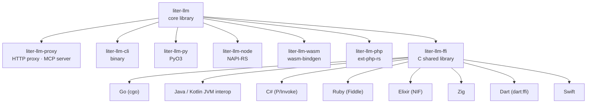
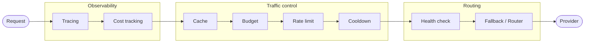
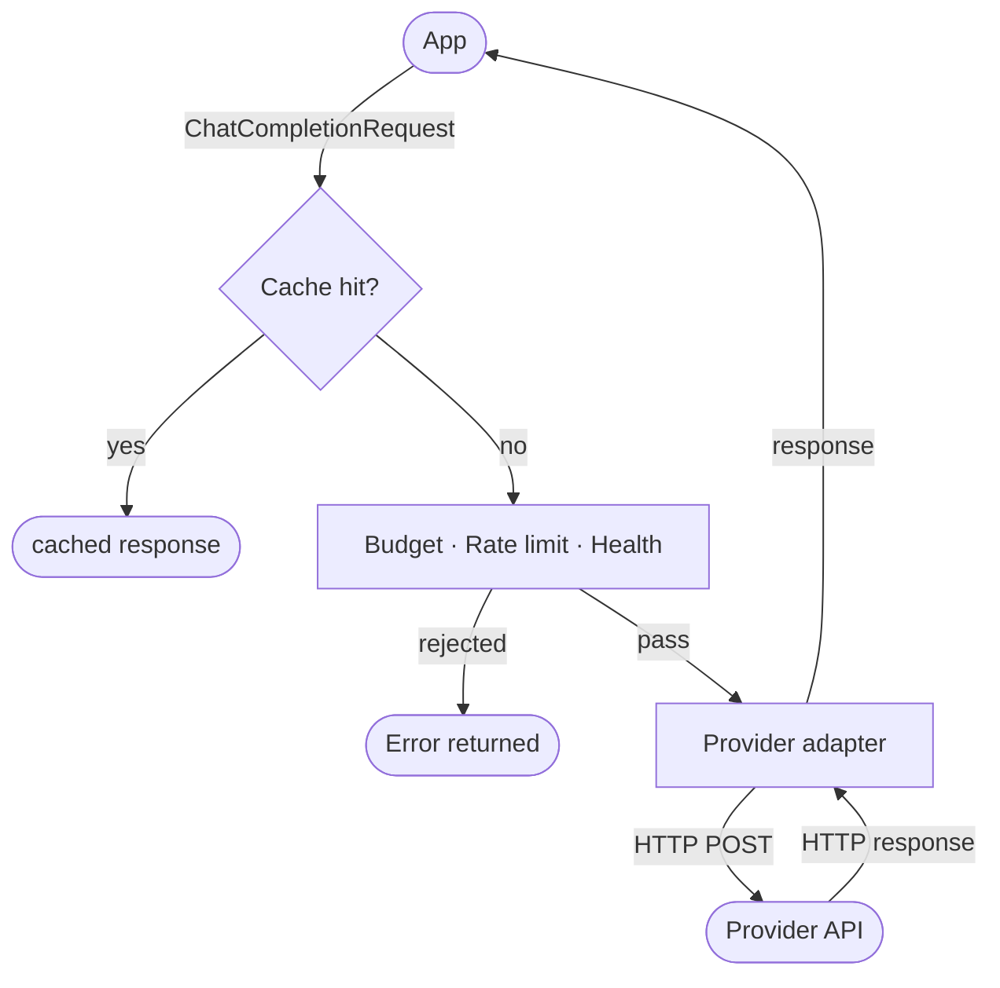

# Architecture

Liter-llm is a Rust-first polyglot library. A small core crate provides the client surface and all provider adapters; a proxy crate and a CLI layer on top; 14 language bindings wrap the core via native extensions or the C FFI shared library.

## Crate graph



The `liter-llm` core crate never depends on any binding. All knowledge flows in one direction: core outward to bindings, CLI, and proxy.

## Core library structure

```text
crates/liter-llm/src/
  client/            # LlmClient + FileClient + BatchClient + ResponseClient + DefaultClient
  error.rs           # LiterLlmError enum (17 variants)
  cost.rs            # Per-call cost estimation
  tokenizer.rs       # HuggingFace tokenizer bridge (feature-gated)
  auth/              # Credential providers — Azure AD, AWS SigV4, Vertex OAuth2, Copilot
  http/              # reqwest-backed HTTP client, SSE parser, retry logic
  provider/          # Per-provider adapters (OpenAI, Anthropic, Google, Bedrock, Vertex, …)
  tower/             # Tower middleware layers (feature `tower`)
  types/             # Request and response types (OpenAI wire format)

crates/liter-llm/schemas/
  providers.json     # 143 runtime providers plus schema metadata and complex-provider names
```

## Public surface

The core crate re-exports a curated set of symbols at its root:

| Surface           | Items                                                                                                                                                                |
| ----------------- | -------------------------------------------------------------------------------------------------------------------------------------------------------------------- |
| Client traits     | `LlmClient`, `LlmClientRaw`, `BatchClient`, `FileClient`, `ResponseClient`                                                                                           |
| Default impl      | `DefaultClient`, `ManagedClient` (with `tower` feature)                                                                                                              |
| Constructors      | `create_client(...)`, `create_client_from_json(...)`                                                                                                                 |
| Config            | `ClientConfig`, `ClientConfigBuilder`, `FileConfig`                                                                                                                  |
| Custom providers  | `register_custom_provider`, `unregister_custom_provider`, `CustomProviderConfig`, `AuthHeaderFormat`                                                                 |
| Provider registry | `ProviderConfig`, `all_providers()`, `complex_provider_names()`                                                                                                      |
| Errors            | `LiterLlmError`, `Result<T>`                                                                                                                                         |
| Types             | All `types::*` submodules — `chat`, `embedding`, `image`, `audio`, `files`, `batch`, `responses`, `rerank`, `search`, `ocr`, `moderation`, `models`, `raw`, `common` |

Internal modules (`http`) are `pub(crate)` and not part of the public API.

`LlmClient` covers the core model operations: `chat`, `chat_stream`, `embed`, `list_models`, `image_generate`, `speech`, `transcribe`, `moderate`, `rerank`, `search`, and `ocr`. File uploads and retrieval use `FileClient`; batch jobs use `BatchClient`; OpenAI Responses API operations use `ResponseClient`.

## Tower middleware stack

When the `tower` feature is enabled, every request flows through a chain of composable Tower layers. The proxy builds the full stack; library users assemble any subset they need.



Layers run outermost to innermost. `CacheLayer` short-circuits the stack on a hit (before traffic control). `BudgetLayer` rejects a request before it reaches the network if it would exceed the configured spend cap.

| Layer                 | File                  | Purpose                                            |
| --------------------- | --------------------- | -------------------------------------------------- |
| `TracingLayer`        | `tower/tracing.rs`    | Emits OpenTelemetry `gen_ai` spans                 |
| `CostTrackingLayer`   | `tower/cost.rs`       | Records `gen_ai.usage.cost` on the span            |
| `CacheLayer`          | `tower/cache.rs`      | In-memory response cache (LRU, configurable TTL)   |
| `BudgetLayer`         | `tower/budget.rs`     | Hard/soft spend caps per key                       |
| `ModelRateLimitLayer` | `tower/rate_limit.rs` | RPM / TPM sliding-window limits                    |
| `CooldownLayer`       | `tower/cooldown.rs`   | Per-provider backoff after transient errors        |
| `HealthCheckLayer`    | `tower/health.rs`     | Marks providers unhealthy after failure threshold  |
| `HooksLayer`          | `tower/hooks.rs`      | Pre/post-request hook execution                    |
| `FallbackLayer`       | `tower/fallback.rs`   | Primary-plus-backup failover on transient errors   |
| `Router`              | `tower/router.rs`     | Multi-deployment load distribution                 |
| `LlmService`          | `tower/service.rs`    | Bridges `LlmClient` into the Tower `Service` trait |

The optional `opendal-cache` feature swaps the in-memory cache for an OpenDAL-backed store (S3, GCS, Azure Blob, Redis, filesystem) via `OpenDalCacheStore`.

`Router` supports four strategies: `RoundRobin`, `LatencyBased`, `CostBased`, and `WeightedRandom`. Ordered-fallback is provided separately by `FallbackLayer`.

## Request lifecycle



On a transient provider error, `FallbackLayer` replays the request on the configured backup. If a `Router` is configured, requests are distributed across deployments before reaching `LlmService`.

## Language binding strategy

All 14 bindings share the same Rust core. Four native-extension crates and one C FFI crate cover the binding surface:

| Approach         | Crate            | Used by                                               |
| ---------------- | ---------------- | ----------------------------------------------------- |
| PyO3             | `liter-llm-py`   | Python                                                |
| napi-rs          | `liter-llm-node` | TypeScript / Node.js                                  |
| wasm-bindgen     | `liter-llm-wasm` | WebAssembly (browsers, Cloudflare Workers, Deno, Bun) |
| ext-php-rs       | `liter-llm-php`  | PHP                                                   |
| C ABI shared lib | `liter-llm-ffi`  | Go, Java, Kotlin Android, C#, Ruby, Elixir, Dart, Swift, Zig  |

The C FFI surface is the only one that exposes Rust types as opaque handles. All FFI-consuming bindings use their language-native FFI mechanism — cgo, Panama FFM, P/Invoke, Fiddle, NIF, `dart:ffi`, Swift's C interop, Zig's `@cImport` — to call the shared library. Error context (variant label, numeric code, message) is preserved across the boundary so each binding can throw a typed exception.

The WASM binding compiles to a JS bundle and uses the browser/Node fetch API in place of reqwest; this is gated by the mutually-exclusive `wasm-http` feature instead of `native-http`.

## Proxy structure

```text
crates/liter-llm-proxy/src/
  auth/              # Auth key store + validation
  config/            # TOML config structs + env-var interpolation
  routes/            # Axum route handlers (23 routes)
  mcp/               # MCP server (22 tools via rmcp)
  error.rs           # Error types and HTTP mapping
  file_store.rs      # OpenDAL file storage backend
  lib.rs             # Module exports
  openapi.rs         # OpenAPI spec generation
  service_pool.rs    # Builds the Tower stack per model
  state.rs           # Shared application state
  streaming.rs       # SSE response streaming
```

The proxy builds one Tower stack per `[[models]]` entry at startup. Stacks are stored in a `ServicePool` indexed by model name and alias. Incoming requests authenticate via the master key or a virtual key (`[[keys]]`), then route to the matching stack.

See [Proxy Server](../server/proxy-server.md) and [Proxy Configuration](../server/proxy-configuration.md) for operational details.
